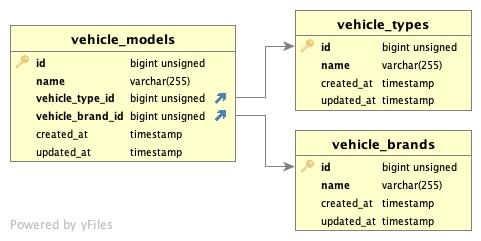

##

###Database Design



###Demo

- url: https://renos.gj.lc/


### How to run

```bash

# Clone the repository and go to the cloned directory

# install Composer dependencies/packages
$ composer install


$ cp .env.example .env
# then edit .env file to match your database configuration

$ php artisan key:generate

# Migrate and run seeding (do this every any update on the migration and the seeder)
$ php artisan migrate
$ php artisan db:seed 

#if you want to run in development use this:
$ php artisan serve

#if you want to run in production just set up on the web server or container(docker)

```
